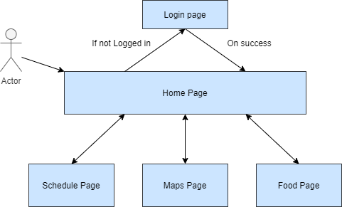

# Qlink

A mobile application that summarizes Queen's University online information particular to a student to help them get through the day!
The application will require a user to login with their Queen's University account and will present their class Schedule, Dining Menus, Meal Plan balances, Study Halls etc.

## Features

The priorities, in decending importance, are:
- `Necessary`
- `Should Have`
- `Want`

| Feature                                                                                       | Priority    |
|-----------------------------------------------------------------------------------------------|-------------|
| Login - Full Login Functionality                                                              | Necessary   |
| Schedule - Fully implemented schedule page                                                    | Necessary   |
| Food - Shows all dining hall menus for today                                                  | Necessary   |
| Food - Shows Meal Plan information (Flex Money and Tam numbers)                               | Necessary   |
| Notifications from the app for users schedule                                                 | Should Have |
| Home - shows your next class                                                                  | Should Have |
| Home - List all classes                                                                       | Should Have |
| Home - classes are clickable to display lecture schedule                                      | Should Have |
| Maps - List off locations for classes                                                         | Should Have |
| Maps - List off locations for studying                                                        | Should Have |
| Maps - List off locations for food                                                            | Should Have |
| Home - List of campus information asynchronously fetched and page updated dynamically         | Want        |
| Food - shows what's open and automatically goes to the current menu (like breakfast or lunch) | Want        |
| Maps - Notify user when they should leave for the coming class                                | Want        |

**Table 1** - All planned app features. The titles are in the format `Page Name - feature description`

## Development 

Details front-end and back-end designs and technologies used for implementation.

### Front-end Design
The team used Adobe XD to create multiple prototypes of the front-end UI/UX. This program allowed us to include basic user inputs/interactions to perfect the design that was created through extensive research into current related competitive offering and popular design standards like Google's Material Design.

**Diagram 1.1** - A users basic high level navigation around the application 

The following shows a few gifs as examples of the ability of Adobe XD prototype with user interactions in it's final form.

**Diagram 1.2** - A gif of the home screen and a user clicking on one of their courses to see the details page

**Diagram 1.3** - A gif of the user navigating to the schedule screen the home screen and interacting with it

### Back-end Design

The application has a non-public API that is used to gather data from Queen's University and the students information. The application will use React-Redux for its data management and [Redux-Persist](https://github.com/rt2zz/redux-persist) to store the application state on the device. This application state will be updated in asynchronous method calls in certain even listeners in the application. In addition, we will utilize the component lifecycle to update the state when certain components mount (such as the food page fetching the days menus), and these components shall be connected directly to the redux state. We notice a critical aspect will be to manage when a component does update to ensure the proper efficiency of the program. For example, if we fetch the days classes on the schedule screen, there is no need to update and re-render the list of available days.

### Implementation

This program is implemented using React Native, specifically expo. This was choosen due to the small development team's requirement for 1 cross platform code base. In addition, the application does not have any requirements for native development and thus we can further simplify and abstract our framework to expo. 

